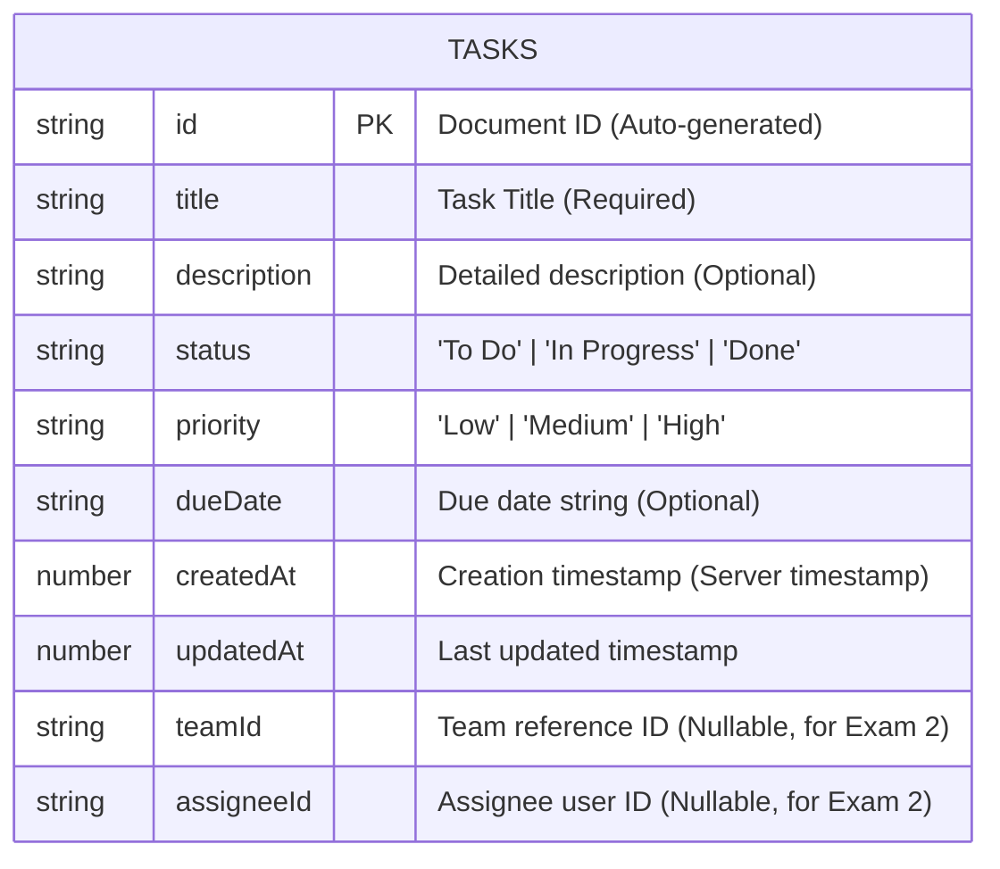

# Task Management App (Practical Exam 1)

A mobile Task Management application built with **React Native (Expo)**, **TypeScript**, and **Firebase Cloud Firestore**.

---

## 📱 Features

- **Public Task CRUD (No Authentication required)**:
  - **Create Task**: Form & modal with client-side validation (title, description, status, priority, due date).
  - **Read Tasks**: Real-time synchronization using Firestore `onSnapshot` listener.
  - **Edit Task**: Update task title, description, priority, and status with pre-filled modal.
  - **Delete Task**: Confirmation prompt before removing task permanently from Firestore.
- **Bottom Tab Navigation**:
  - **Home**: Main task manager with stats counter, status filter, and realtime task list.
  - **Teams**: "Coming Soon" placeholder screen for team collaboration (Exam 2).
  - **Profile**: "Coming Soon" placeholder screen for user profile & authentication (Exam 2).
- **Status Filter**: Filter tasks by `All`, `To Do`, `In Progress`, and `Done`.
- **Responsive Layout**: Clean modern UI supporting phone and tablet form-factors.
- **Pull-to-refresh**: Visual refresh indicator on the task list.

---

## 🛠️ Tech Stack

- **Framework**: React Native with Expo (SDK 57)
- **Language**: TypeScript
- **Navigation**: React Navigation (Bottom Tabs v7)
- **Database**: Firebase Cloud Firestore
- **Code Quality**: ESLint, Prettier, GitHub Actions CI

---

## 🗄️ Firestore Data Model (ERD)

The database uses the `tasks` collection in Cloud Firestore.



### Document Fields Reference:

| Field         | Type                                 | Description                                 |
| ------------- | ------------------------------------ | ------------------------------------------- |
| `id`          | `string`                             | Auto-generated document ID in Firestore     |
| `title`       | `string`                             | Title of the task (Required)                |
| `description` | `string`                             | Detailed note / task description (Optional) |
| `status`      | `'To Do' \| 'In Progress' \| 'Done'` | Current progress of the task                |
| `priority`    | `'Low' \| 'Medium' \| 'High'`        | Priority classification                     |
| `dueDate`     | `string \| null`                     | Deadline date string (e.g. `2026-10-15`)    |
| `createdAt`   | `Timestamp / number`                 | Timestamp of task creation                  |
| `updatedAt`   | `Timestamp / number`                 | Timestamp of last modification              |
| `teamId`      | `string \| null`                     | Reserved for Practical Exam 2               |
| `assigneeId`  | `string \| null`                     | Reserved for Practical Exam 2               |

---

## 📂 Project Structure

```
├── .github/
│   └── workflows/
│       └── ci.yml               # GitHub Actions CI (lint & type-check)
├── assets/                      # Application icons and splash images
├── src/
│   ├── components/
│   │   ├── TaskCard.tsx         # Task item card with actions
│   │   └── TaskModal.tsx        # Create & Edit modal form with validation
│   ├── config/
│   │   └── firebaseConfig.example.ts  # Config template
│   ├── hooks/
│   │   └── useTasks.ts          # State management & realtime sync hook
│   ├── navigation/
│   │   └── BottomTabNavigator.tsx     # React Navigation bottom tabs
│   ├── screens/
│   │   ├── HomeScreen.tsx       # Main task dashboard screen
│   │   ├── TeamsScreen.tsx      # Teams Coming Soon placeholder
│   │   └── ProfileScreen.tsx    # Profile Coming Soon placeholder
│   ├── services/
│   │   ├── firebase.ts          # Firebase app and Firestore init
│   │   └── taskService.ts       # Firestore CRUD operations
│   ├── theme/
│   │   └── colors.ts            # Color palette tokens
│   └── types/
│       └── task.ts              # TypeScript models and DTOs
├── .env.example                 # Environment variables template
├── .eslintrc.js                 # ESLint rules
├── .prettierrc                  # Prettier formatting rules
├── App.tsx                      # Root component
└── package.json
```

---

## 🚀 Getting Started

### 1. Prerequisites

- Node.js (v18 or v20 recommended)
- Expo Go app on mobile device or Android/iOS Emulator

### 2. Installation

```bash
npm install
```

### 3. Setup Firebase

Copy `.env.example` to `.env` or verify configuration in `src/services/firebase.ts`.

### 4. Run the Application

```bash
npx expo start
```

- Press `a` for Android Emulator.
- Press `w` for Web preview.
- Scan QR code with **Expo Go** on a physical phone.

### 5. Quality Checks

```bash
# TypeScript type check
npm run type-check

# ESLint check
npm run lint

# Code formatter
npm run format
```
