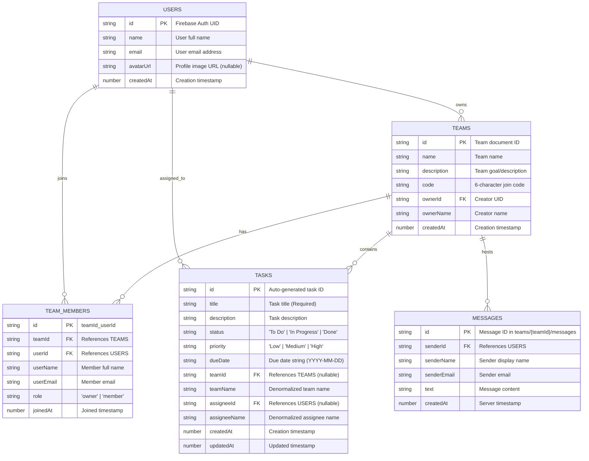

# Task Management App (Practical Exam 1 & 2)

A production-grade mobile Task Management application built with **React Native (Expo)**, **TypeScript**, **Firebase Authentication**, and **Cloud Firestore**.

Designed with **Linear-tier & Apple Human Interface Guidelines** (ultra-clean minimalism, high-contrast typography, hairline borders, and Feather vector icons).

---

## 📱 Features (Exam 1 & Exam 2)

### 🔐 1. Firebase Authentication (Exam 2)
- **Sign Up**: Register with Full Name, Email, and Password. Creates a Firebase Auth user and a matching profile document in the `users` collection.
- **Login**: Email & Password sign-in with clear error handling.
- **Persisted Session**: Automatically restores user session on app launch via `onAuthStateChanged`.
- **Protected Navigation**: Unauthenticated users are gated behind Login / SignUp screens.
- **Profile & Logout**: View user details (Name, Email, UID) and securely sign out with one click.

### 👥 2. Real Teams & Collaboration (Exam 2)
- **Create Team**: Generate a new team with Name, Description, and an auto-generated 6-character invitation code.
- **Join Team**: Enter a 6-character team code to instantly become a member.
- **Team Detail Screen**:
  - View team details and share invitation code.
  - View all team members with their roles (`owner` vs `member`).
  - View all tasks assigned to the team.
  - Quick action button to enter the **Team Real-Time Chat**.

### 💬 3. Real-Time Team Chat (Exam 2)
- **One Chat per Team**: Dedicated real-time communication channel for each team.
- **Firestore Subcollection**: Messages stored in `teams/{teamId}/messages`.
- **Real-Time Sync**: Subscribed via `onSnapshot` listener (instant message delivery without polling).
- **Interactive UI**: Linear-style chat bubbles with distinct styling for sender vs others, timestamps, and smooth auto-scroll.

### 📋 4. Task Management & Assignment (Exam 1 & 2)
- **Create & Edit Tasks**: Modal form with client-side validation.
- **Assignment**: Link tasks to a specific **Team** (`teamId`) and assign to a specific **Team Member** (`assigneeId`).
- **Real-Time Task List**: Real-time Firestore sync with status filtering (`All`, `To Do`, `In Progress`, `Done`).
- **Pull-to-refresh & Quick Status Toggle**: Intuitive one-tap status completion and refresh.

---

## 🗄️ Database Architecture & ERD (Entity Relationship Diagram)



---

## 🛡️ Firestore Security Rules (`firestore.rules`)

```javascript
rules_version = '2';

service cloud.firestore {
  match /databases/{database}/documents {

    function isAuthenticated() {
      return request.auth != null;
    }

    function isOwner(userId) {
      return isAuthenticated() && request.auth.uid == userId;
    }

    match /users/{userId} {
      allow read: if isAuthenticated();
      allow write: if isOwner(userId);
    }

    match /tasks/{taskId} {
      allow read, write: if isAuthenticated();
    }

    match /teams/{teamId} {
      allow read, write: if isAuthenticated();

      match /messages/{messageId} {
        allow read, write: if isAuthenticated();
      }
    }

    match /teamMembers/{memberId} {
      allow read, write: if isAuthenticated();
    }
  }
}
```

---

## 📂 Project Structure

```
├── src/
│   ├── components/
│   │   ├── DueDatePicker.tsx          # Date selection modal
│   │   ├── EmptyTaskList.tsx          # Clean empty state widget
│   │   ├── HomeHeader.tsx             # Stats bento & filter pills
│   │   ├── SegmentedControl.tsx       # Status & priority controls
│   │   ├── TaskCard.tsx               # Task card with team & assignee tag
│   │   └── TaskModal.tsx              # Task modal with team & member pickers
│   ├── config/
│   │   └── firebase.ts                # Firebase Auth & Firestore init
│   ├── context/
│   │   └── AuthContext.tsx            # Firebase Auth state & provider
│   ├── hooks/
│   │   └── useTasks.ts                # Real-time task hook
│   ├── navigation/
│   │   ├── BottomTabNavigator.tsx     # Home, Teams, Profile tabs
│   │   └── RootNavigator.tsx          # Auth stack vs App stack gate
│   ├── screens/
│   │   ├── auth/
│   │   │   ├── LoginScreen.tsx        # Sign-in screen
│   │   │   └── SignUpScreen.tsx       # Registration screen
│   │   ├── chat/
│   │   │   └── ChatScreen.tsx         # Real-time team messaging
│   │   ├── teams/
│   │   │   ├── TeamsScreen.tsx        # Team list, create & join by code
│   │   │   └── TeamDetailScreen.tsx   # Team members, tasks & chat entry
│   │   ├── HomeScreen.tsx             # Dashboard task list
│   │   └── ProfileScreen.tsx          # User profile & logout
│   ├── services/
│   │   ├── chatService.ts             # Firestore messages subcollection
│   │   ├── taskService.ts             # Tasks CRUD & team query
│   │   ├── teamService.ts             # Teams & membership operations
│   │   └── userService.ts             # User profiles management
│   ├── theme/
│   │   └── colors.ts                  # Linear design tokens
│   └── types/                         # TypeScript interfaces
├── firestore.rules                    # Security rules configuration
├── EXAM_REPORT_GUIDE.md               # Practical Exam 1 report template
├── EXAM2_REPORT_GUIDE.md              # Practical Exam 2 report template
├── App.tsx                            # Root application entry
└── package.json
```

---

## 🚀 Running the App

```bash
# 1. Install dependencies
npm install

# 2. Run with Expo
npx expo start

# 3. Check code quality
npm run type-check
npm run lint
npm run format
```
